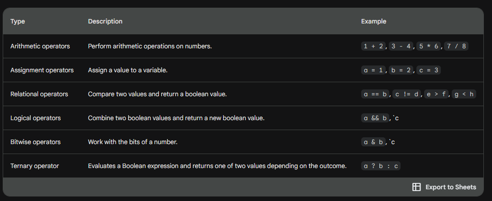

## Types of Operators

An operator is a symbol that performs a specific operation on one or more operands. The operand is the data that the operator acts on. For example, in the expression 1 + 2, the operators are + and 1 and 2 are the operands.

There are many different types of operators in Java, each with its own purpose. Some of the most common types of operators include:

- Arithmetic operators: These operators perform arithmetic operations on numbers. For example, the + operator adds two numbers, the - operator subtracts two numbers, and the * operator multiplies two numbers.
- Assignment operators: These operators assign a value to a variable. For example, the = operator assigns the value of the expression on the right-hand side to the variable on the left-hand side.
- Relational operators: These operators compare two values and return a boolean value indicating whether the two values are equal, not equal, greater than, less than, etc. For example, the == operator compares two values and returns true if they are equal, and false otherwise.
- Logical operators: These operators combine two boolean values and return a new boolean value. For example, the && operator returns true if both of its operands are true, and false otherwise.
- Bitwise operators: These operators work with the bits of a number. For example, the & operator performs a logical AND on the bits of two numbers.

